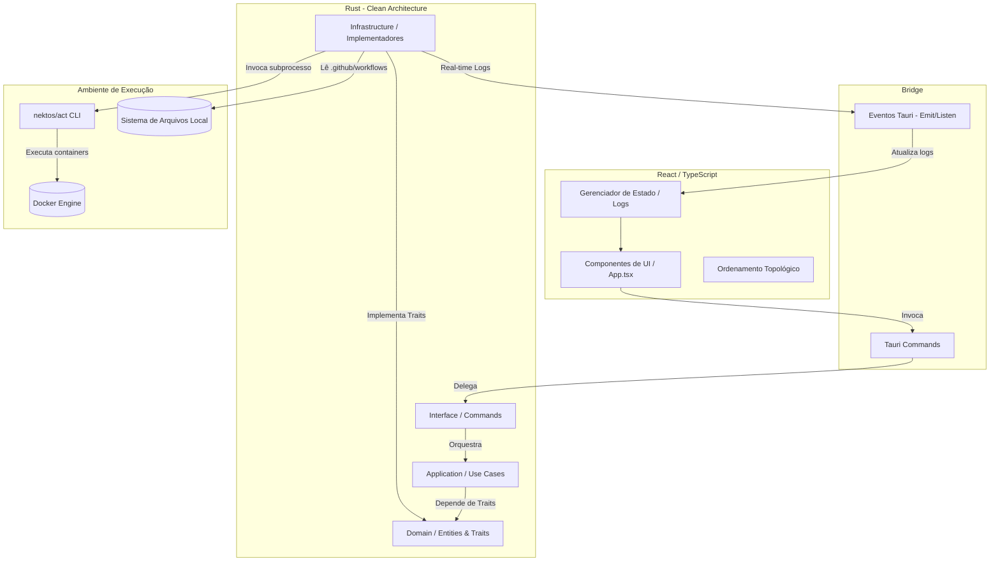

# Arquitetura do Gale

O Gale é uma aplicação desktop desenvolvida com **Tauri**, **React**, **TypeScript** e **Rust**. Ele atua como uma interface visual moderna para executar e depurar workflows do GitHub Actions localmente no Docker utilizando a ferramenta CLI `act`.

Esta documentação detalha a estrutura do projeto, o fluxo de dados e os princípios de design adotados.

---

## 🏗️ Visão Geral do Sistema

A arquitetura do Gale baseia-se na separação estrita de responsabilidades entre a interface de usuário (Frontend em React) e o núcleo de orquestração do sistema (Backend em Rust), interconectados pelo mecanismo de IPC (Inter-Process Communication) do Tauri.

---

## 🦀 Backend (Rust) - Clean Architecture

O backend em [src-tauri/src](file:///d:/Projects/gale/src-tauri/src) segue os princípios da **Clean Architecture** (Arquitetura Limpa), dividida em quatro camadas independentes:

### 1. Camada de Domínio (`domain`)
Contém as entidades de negócio puras e as definições de interfaces (traits) sem dependências externas.
*   **Entidades ([domain/pipeline.rs](file:///d:/Projects/gale/src-tauri/src/domain/pipeline.rs))**:
    *   `Workflow`: Estrutura do arquivo YAML de workflow do GitHub Actions.
    *   `Job`: Unidade de execução dentro de um workflow.
    *   `Step`: Passo individual dentro de um job (comando CLI ou Action externa).
    *   `LogLine`: Linha de log produzida em tempo real durante a execução de um job.
*   **Contratos (Traits)**:
    *   `PipelineEngine`: Define o parsing de workflows.
    *   `RepositoryProvider`: Define o método de listagem de workflows no sistema de arquivos.
    *   `RunnerService`: Define o mecanismo assíncrono de execução de jobs.

### 2. Camada de Aplicação (`application`)
Implementa as regras de negócio e os casos de uso da aplicação, orquestrando as entidades do domínio através das interfaces declaradas.
*   **Casos de Uso ([application/use_cases.rs](file:///d:/Projects/gale/src-tauri/src/application/use_cases.rs))**:
    *   `ListWorkflowsUseCase`: Coleta os arquivos de workflows locais e faz o parse com a engine adequada.
    *   `RunJobUseCase`: Executa assincronamente um job e direciona os logs.
    *   `CheckDependenciesUseCase`: Verifica de forma portátil se `docker` e `act` estão instalados.

### 3. Camada de Infraestrutura (`infrastructure`)
Contém os adaptadores e as implementações concretas das interfaces do domínio, lidando com serviços externos, sistema de arquivos e processos.
*   **Adaptadores ([infrastructure](file:///d:/Projects/gale/src-tauri/src/infrastructure))**:
    *   `fs_provider.rs`: Implementação concreta de `RepositoryProvider` para varrer a pasta `.github/workflows`.
    *   `github.rs`: Implementação de `PipelineEngine` usando parsers de YAML para ler as declarações de workflows do GitHub Actions.
    *   `watcher.rs`: Observador de mudanças em tempo real utilizando APIs do sistema de arquivos para avisar o frontend caso os arquivos YAML mudem.
    *   `act.rs`: Implementador do `RunnerService`. Executa subprocessos do `act` CLI de forma assíncrona, interceptando as saídas de `stdout` e `stderr` linha a linha para disparar eventos para o frontend, mantendo controle de referências para cancelamento rápido (`stop_active_process`).

### 4. Camada de Interface (`interface`)
Centraliza os pontos de entrada acessíveis via IPC do Tauri.
*   **Comandos ([interface/commands.rs](file:///d:/Projects/gale/src-tauri/src/interface/commands.rs))**:
    *   Registra os `#[tauri::command]` que mapeiam as requisições do frontend para os casos de uso correspondentes.

---

## 💻 Frontend (React + TypeScript)

O frontend implementa a exibição em tempo real do status de execução e a gestão dos workflows.

### 🧩 Ordenamento Topológico
Como o GitHub Actions permite que jobs declarem dependências uns dos outros por meio do campo `needs` (ex: o job de deploy precisa que o job de teste finalize), o Gale gerencia isso calculando a ordem exata de execução local por meio de um algoritmo de **Ordenamento Topológico** implementado na interface.

O método `getTopologicallySortedJobs` resolve esse grafo acíclico dirigido (DAG) e garante que:
1. O workflow seja executado passo a passo na sequência correta.
2. Caso um job dependente falhe, os subsequentes que precisam dele sejam automaticamente marcados com erro ou pulados.

### 🔑 Gerenciamento de Segredos (Secrets)
Para executar deploys e integrações locais, segredos são frequentemente necessários. O Gale resolve isso localmente sem expô-los:
1. Os segredos são informados na interface ou importados a partir de um `.env` local.
2. Eles são armazenados de forma isolada em arquivos locais ocultos localizados na pasta de dados da aplicação (`AppData/secrets/[hash].secrets`).
3. O nome do arquivo é o hash SHA da rota absoluta do repositório, garantindo isolamento total por projeto.
4. Quando o `act` é executado, o Gale injeta temporariamente esses segredos de forma segura no runner do container.

### 📡 Comunicação em Tempo Real (Eventos IPC)
Para evitar travamentos de tela causados por operações pesadas de subprocessos e permitir atualizações instantâneas de logs:
1. O backend abre canais de streaming de saída em Rust.
2. Cada linha capturada do `stdout`/`stderr` do container do `act` dispara um evento `runner-log` via `AppHandle.emit`.
3. O frontend escuta continuamente esse evento e atualiza o console virtual dinamicamente.
